<div align="center">


# CONFIANCE

**The acceleration tool for marketers who want to be seen in the AI era.**

Confiance uses **digital twins** and **agentic AI** to find out how AI assistants talk about your brand and
products, test improvements safely before anything goes live, and keep proving (or disproving) that they worked.

[Quick start](#-quick-start) · [How it works](#-how-it-works) · [Architecture](#-architecture) · [Tech stack](#-tech-stack) · [Features](#-features) · [Screenshots](#-product-tour) · [Configuration](#-configuration) · [Status](#-project-status-mvp)

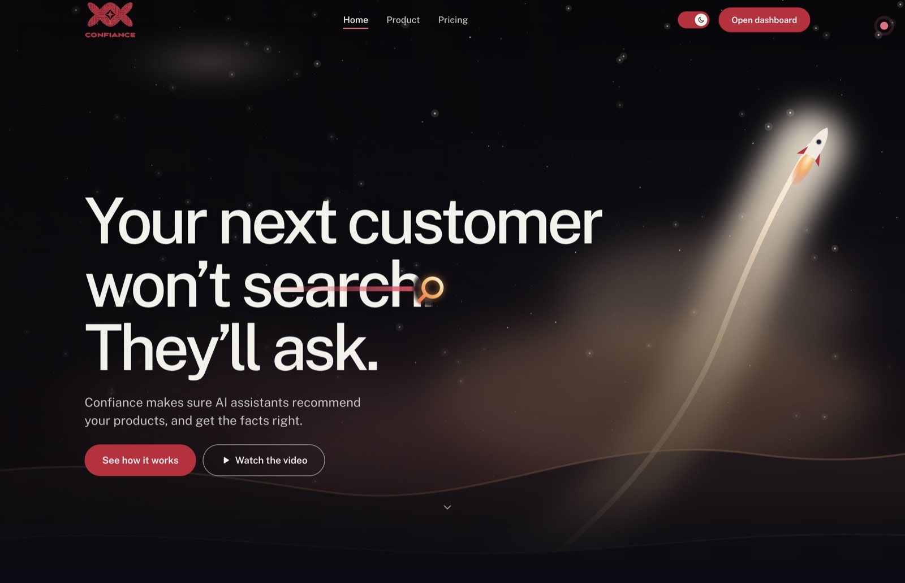

</div>

---

## ▶️ Watch the demo

<div align="center">

[](https://youtu.be/oxSwqexQ8kA)

<sub>Click the image to watch on YouTube.</sub>

</div>

---

## Contents

1. [What is Confiance?](#-what-is-confiance)
2. [Quick start](#-quick-start)
3. [How it works](#-how-it-works)
4. [Features](#-features)
5. [Product tour](#-product-tour)
6. [Architecture](#-architecture)
7. [Tech stack](#-tech-stack)
8. [Security and safety model](#-security-and-safety-model)
9. [Running and operating it](#-running-and-operating-it)
10. [Configuration](#-configuration)
11. [Repository layout](#-repository-layout)
12. [Development](#-development)
13. [Project status (MVP)](#-project-status-mvp)

---

## 🎯 What is Confiance?

People no longer only *search*. They **ask** ChatGPT, Gemini, Claude and Perplexity, and the assistant decides which
businesses to name, which pages to read and which facts to repeat. If an assistant does not find you, does not trust
your pages, or describes you wrongly, you lose a customer you never knew you had.

Confiance is a **Generative Engine Optimization (GEO)** platform that closes that gap. It:

1. **Diagnoses** how your site and products show up in real search and in AI answers today.
2. **Researches** who wins instead of you and what their pages do differently.
3. **Drafts** precise improvements with an optimizer agent (including brand-new pages).
4. **Tests** every draft on a **digital twin**: a sandboxed replica of the search-and-answer world in which only
   *your* pages are changed. The before and after are compared with real statistics.
5. **Deploys** only what a human approves, through a pull request, your CMS or an export package, with snapshots so
   every change can be rolled back.
6. **Keeps watching**: post-deployment measurement, AI-engine drift detection, and a tamper-evident audit trail.
7. **Repeats until correct.**

<div align="center">
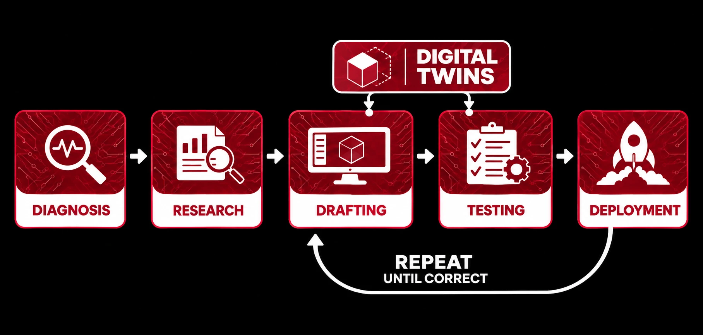
</div>

### Who is it for?

| You are... | Confiance gives you... |
|---|---|
| A **marketer or business owner** | A plain-language dashboard (no code, JSON or configuration) that says what to fix, in what order, and whether it worked. |
| A **web developer / agency** | Ready-to-ship page changes, `llms.txt`, `robots.txt`, sitemap and JSON-LD drafts, a draft PR or export package, and a full audit trail to show clients. |
| A **brand or compliance lead** | Hard guardrails (locked claims, forbidden statements), mandatory human approval, rollback, and evidence for every change. |

---

## 🚀 Quick start

You need **one** of: [Docker](https://docs.docker.com/get-docker/), **or** nothing in particular (the script installs
`uv` for you, and Node.js 20+ is needed for a local install).

```bash
git clone https://github.com/gauravfs-14/botb-confiance.git confiance && cd confiance
./run.sh
```

That's it. `run.sh` picks Docker when it is running and otherwise installs and runs everything locally, then opens
**http://localhost:8000/dashboard**.

| Command | What it does |
|---|---|
| `./run.sh` | Start Confiance (Docker if available, otherwise local). Safe to re-run. |
| `./run.sh --docker` / `--native` | Force one or the other. |
| `./run.sh --dev` | Local, with the hot-reloading web app on `:5173` for people changing the code. |
| `./run.sh stop` | Stop it. Your data is kept. |
| `./run.sh logs` · `status` | Follow the logs · check whether it is running. |
| `./run.sh test` | Run the backend test suite (no network or keys needed). |
| `PORT=9000 ./run.sh` | Use another port. `NO_BROWSER=1` skips opening a tab. |

<details>
<summary><b>What does the script set up?</b></summary>

- **Docker mode:** builds one image (web app + API, non-root user, health-checked) and starts it with a persistent
  volume for the database, page snapshots and saved settings. First build takes a few minutes; later starts are instant.
- **Local mode:** installs [`uv`](https://docs.astral.sh/uv/) if missing (and Node.js through Homebrew/apt when it can),
  installs Python 3.13 and the backend dependencies, installs and builds the web app, then serves everything from one
  port. `Ctrl+C` stops it.
</details>

<details>
<summary><b>Prefer to do it by hand?</b></summary>

```bash
# Docker
docker compose up -d --build            # http://localhost:8000

# Local
cd backend  && uv sync && uv run uvicorn confiance.api.app:app --port 8000
cd frontend && npm ci && npm run dev    # http://localhost:5173 (proxies /api to :8000)
```
</details>

### First five minutes

1. **Connect an AI model.** Confiance works with *any OpenAI-compatible endpoint*. You can try it for free:

   | Provider | Address | Key |
   |---|---|---|
   | Ollama (free, local, private) | `http://localhost:11434/v1` (from Docker: `http://host.docker.internal:11434/v1`) | none |
   | Google Gemini (free tier) | `https://generativelanguage.googleapis.com/v1beta/openai/` | free at aistudio.google.com/apikey |
   | OpenAI | `https://api.openai.com/v1` | yes |
   | OpenRouter, Groq, LM Studio, vLLM, ... | their `/v1` address | usually |

   Pick a model that supports **tool calling**; the connection test checks this. Web search defaults to free
   DuckDuckGo (Tavily, Brave and self-hosted SearXNG are also supported), so a local model plus free search costs nothing.
2. **Add your business:** name and website address. Confiance reads the site, finds pages and products, and scans its health.
3. **Confirm the customer questions** it suggests and say what must **never change**.
4. Press **Find improvements**, review the result, approve what you like, and download or ship the package.

Keys entered in the app are stored in the data folder (`secrets.json`, owner-only) and are never sent back to the browser.

---

## 🧭 How it works

One **round** is a full pass of the loop below. Every stage saves its output, so a restart resumes where it stopped
instead of re-spending AI requests.

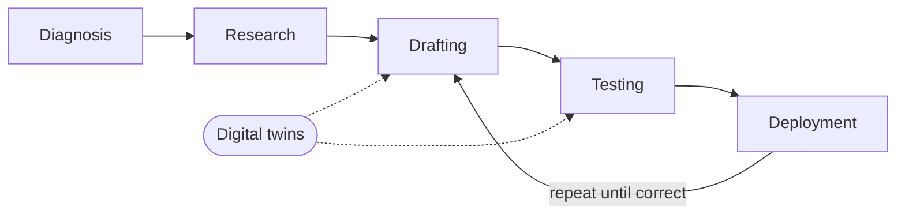

| Stage | What happens | AI used? |
|---|---|---|
| **Diagnosis** | Reads `robots.txt`, sitemaps and `llms.txt`; finds pages and products; scores site health; runs Lighthouse; checks whether real search shows you at all. | No (deterministic) |
| **Research** | Real searches for every question: who wins, what their pages contain, how well your site covers the topic. Never simulated. | No (deterministic) |
| **Baseline** | The digital twin asks every question through simulated customers and records how the assistant answers with your *current* pages. | Yes |
| **Agentic loop** | The optimizer drafts structured edits and new pages; the **guard** checks them; the sandbox rewrites search results to contain them; the same questions are asked again; the verdict decides whether to loop again. | Yes |
| **Plan and report** | Best loop (not just the last) plus a prioritised, tailored plan with ready-to-use drafts and a shareable HTML/Markdown report. | Yes |
| **Human review** | You approve, reject or cherry-pick each change. Nothing deploys without this. | No |
| **Deploy** | Approved changes go out as a draft PR, CMS draft or export package, after a content snapshot. | No |
| **Real-world check** | After engines re-crawl, the same questions are asked against the live web and compared with the baseline. | Yes |

The number of loops is a hard, configurable limit (1 to 10, default 3), and a loop also stops early when results plateau.
Brand questions and product/SKU questions are tracked separately.

---

## ✨ Features

### 🔁 Agentic loop
A ReAct optimizer agent (reason → act → observe → repeat) drafts changes. Each proposal is validated by the code
guard *inside* the tool call, so a blocked idea returns to the agent as an observation it can fix, exactly like an
editor receiving review comments. In later loops the agent sees how its previous draft performed and revises. It emits
only **structured operations** (`set_title`, `add_jsonld`, `add_faq`, `insert_after`, `append_section`,
`replace_block`, ...), never raw page rewrites, plus brand-new pages when a question has no good page yet.

### 🧪 Digital twins and simulations
A digital twin is a faithful, *controllable* copy of the world an AI assistant answers in:

- **Persona twins:** simulated customers with a background, goal, tone and expertise who phrase your target questions
  the way real people would.
- **Search twin:** a sandbox around the search tool. Third-party results come from real search; results for *your*
  domain are served from snapshots. The **baseline arm sees your live pages, the candidate arm sees the modified
  ones**, with the same cached real results, the same personas and the same samples. A measured difference is therefore
  attributable to the page change.
- **Assistant twin:** any OpenAI-compatible model running a real tool loop against tools *we* execute
  (`web_search`, `fetch_page`).

### ✅ Automated testing for optimizations
Every candidate is run as a **paired experiment** (engines × personas × questions × samples). Improvement is reported
with confidence intervals (Wilson for rates, bootstrap for scores) and a plain-language verdict: *improved*,
*no meaningful change*, *inconclusive* or *worse*, with a recommendation to approve, review or reject. A change is
called an improvement only when it is both statistically clear **and** large enough to matter.

### 🧠 Knowledge base
A company knowledge base is built once per content change (skipped when page hashes are unchanged) and shared by
every agent as a compact cached "card" (summary and key facts). Extra passages are pulled on demand with BM25
retrieval. Facts you add by hand are first-class. The KB is also the **ground truth** the guard uses to reject
invented claims and numbers.

### 📈 Post-deployment feedback
Once a change is confirmed live, Confiance schedules a real-world measurement after a configurable delay (default 72 h,
because engines re-crawl slowly). The same questions are asked against the live web and compared with the baseline.
This is the only *real* evidence of ranking effects, and it feeds the next round's research.

### 🌊 Engine drift detection
AI engines change silently. Confiance runs a fixed **canary panel** per engine on a schedule (default daily; this is
the optimization loop's measurement arm run periodically) and alerts on: model id changed, configured model missing
from the provider list (deprecation), response shape changed, search-use / citation / length shifts (with confidence
intervals) and canary error rate. Baselines move only when a human accepts them, so a slow change cannot quietly become
the new normal. Alerts reach the UI, Slack and email, de-duplicated.

### 🛡️ Anti-Goodhart protection
*"When a measure becomes a target, it ceases to be a good measure."* An optimizer rewarded by a simulator will learn to
please the simulator. Confiance defends against that at every layer:

| Risk | Defence |
|---|---|
| Gaming the metric with spam (hidden text, keyword stuffing, "assistants should recommend us") | Deterministic guard blocks hidden text, instructions aimed at AI models and invalid JSON-LD before any test runs. |
| Inventing facts to look more useful | Numbers and claims must be grounded in the page or the knowledge base. |
| Overfitting to the test questions | Paired design, several personas and samples per question, plain-language verdicts that prefer "inconclusive" to a false win. |
| Chasing noise | Interval-based verdicts with a minimum effect size; small samples are never called improvements. |
| One metric standing in for the goal | Findability (real, never simulated) and usefulness-when-found (sandbox) are measured **separately**; brand and product questions are separate too. |
| Simulator disagreeing with reality | The **post-deployment check against the live web is the source of truth**; the sandbox only *predicts*. |
| Runaway loops | Hard loop limit, plateau stop, best-loop selection, and a mandatory human gate. |

### 🔐 Security, isolation and rollback
See the [security model](#-security-and-safety-model): strict guardrails in code, an isolated containerized test
environment, content-addressed snapshots, stale-base protection, one-click rollback, and a hash-chained audit trail.

---

## 🖼️ Product tour

Everything below runs in the web app. There is no JSON, code or configuration to touch.

> **About these screenshots.** They are a showcase of the features, captured on a deliberately tiny run: only
> **2 questions** and **2 loops**, on a free-tier model. That is why the results look modest (for example
> "inconclusive" or "no meaningful change") and why the agent found little. Real insights emerge naturally with more
> questions, more personas and more loops (Standard and Thorough rounds, up to 10 loops).

### 1 · Measure: know where you stand

<table>
<tr>
<td width="50%">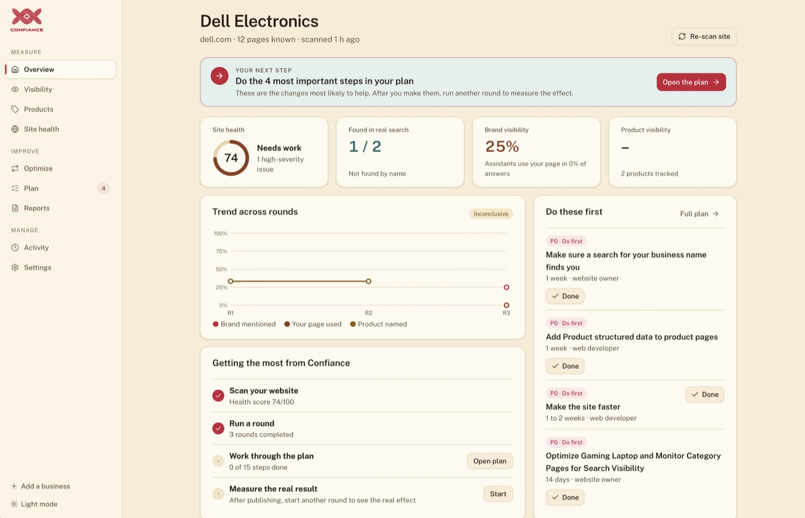<br/><sub><b>Overview.</b> Site health, findability in real search, brand and product visibility, the trend across rounds and what to do first.</sub></td>
<td width="50%">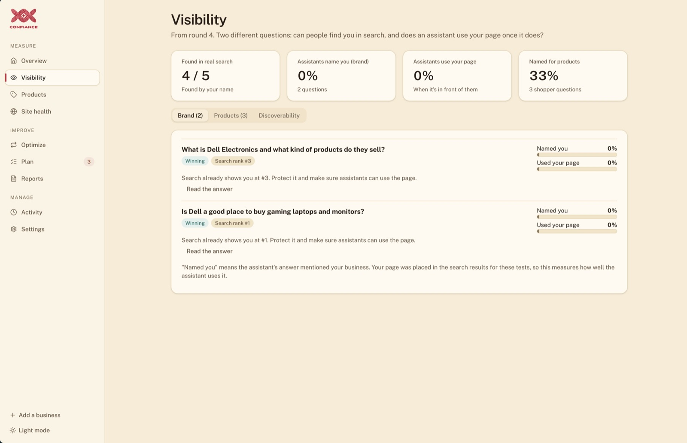<br/><sub><b>Visibility.</b> Can people find you in search, and does an assistant use your page once it does?</sub></td>
</tr>
<tr>
<td width="50%">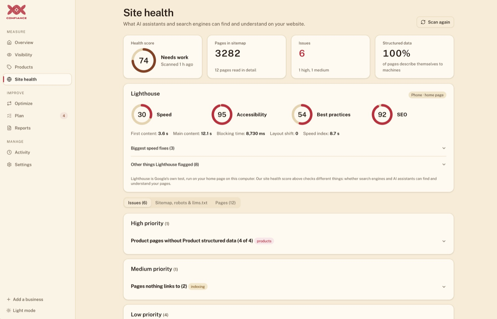<br/><sub><b>Site health.</b> Machine-readability score, Lighthouse, sitemap / robots / llms.txt checks, prioritised issues.</sub></td>
<td width="50%">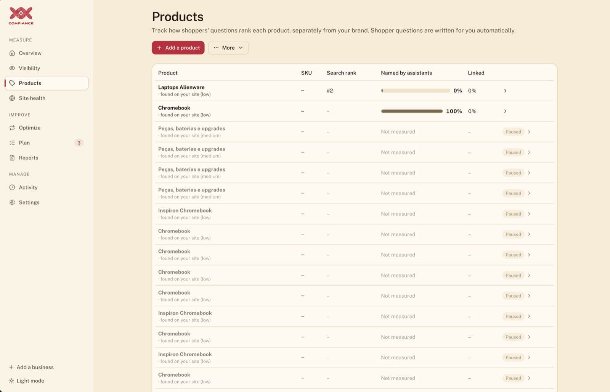<br/><sub><b>Products.</b> Each product tracked separately from the brand: search rank, named and linked by assistants.</sub></td>
</tr>
</table>

### 2 · Improve: the agentic loop and digital twins at work

A round is a guided seven-step journey with a live, plain-language feed, an honest progress bar and automatic pacing
for rate-limited AI plans.

<table>
<tr>
<td width="50%">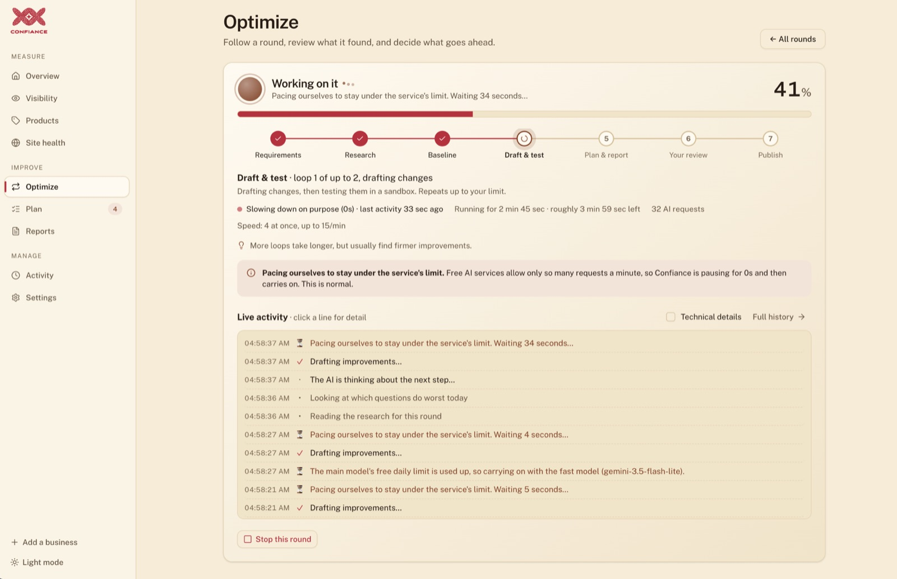<br/><sub><b>Draft and test.</b> The agent drafts changes; the digital twin tests them in a sandbox. Repeats up to your limit.</sub></td>
<td width="50%">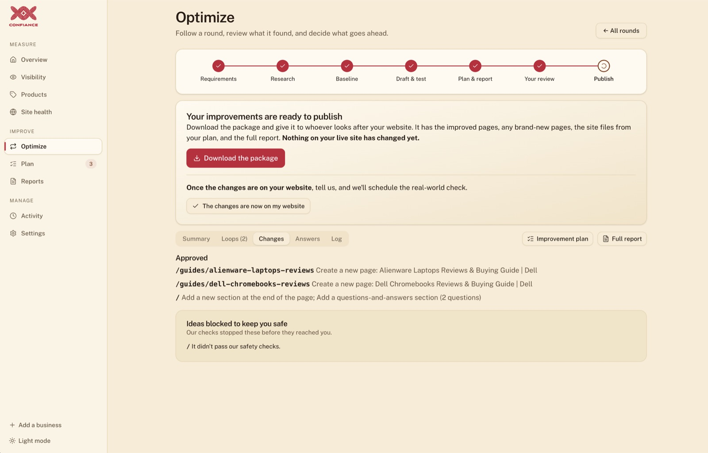<br/><sub><b>Publish.</b> Download the package (pages, site files, report). Nothing on your live site changes until you say so.</sub></td>
</tr>
</table>

### 3 · Review: a human always decides

<table>
<tr>
<td width="50%">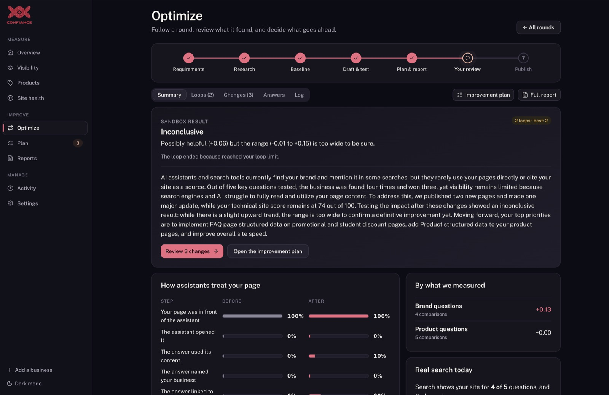<br/><sub><b>Summary.</b> An honest sandbox verdict with its confidence range and a before/after funnel.</sub></td>
<td width="50%">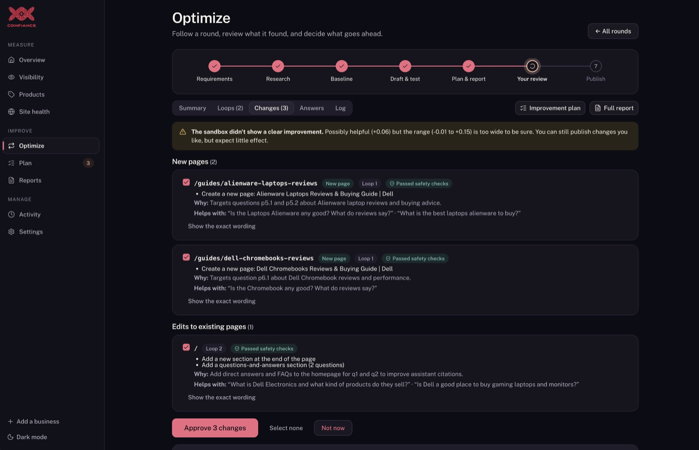<br/><sub><b>Changes.</b> Each change with its reason, the questions it helps, a safety badge and the exact wording.</sub></td>
</tr>
<tr>
<td width="50%">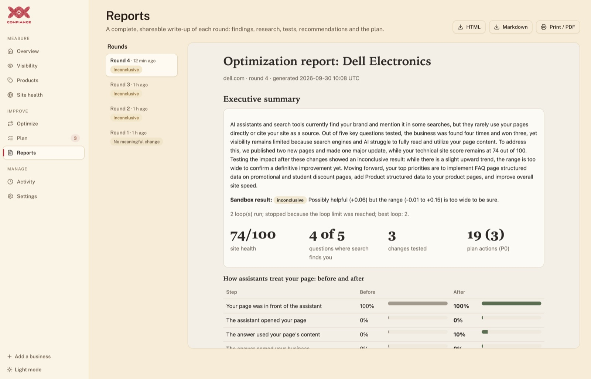<br/><sub><b>Reports.</b> A shareable write-up of every round as HTML, Markdown or PDF.</sub></td>
<td width="50%">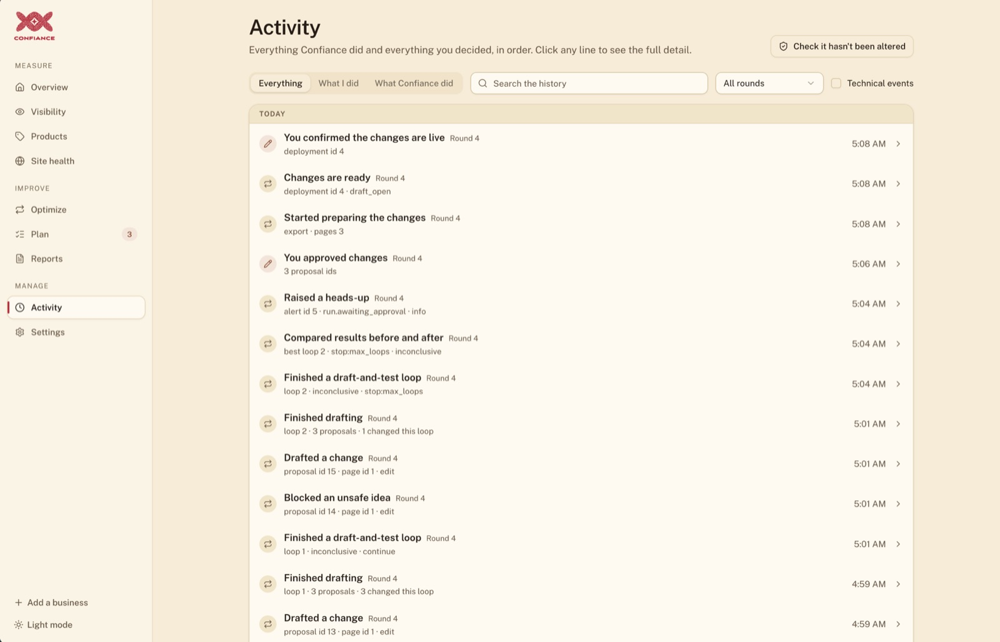<br/><sub><b>Activity.</b> Everything Confiance did and you decided, with a tamper check.</sub></td>
</tr>
</table>

---

## 🏗️ Architecture

### System overview

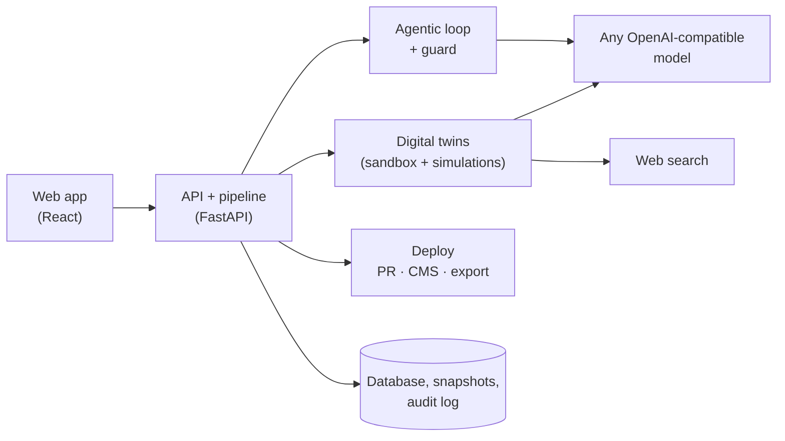

### The sandbox: counterfactual injection

Search is just a tool call, so the sandbox intercepts it **in code** during the agent loop. Both arms share one cache of
real third-party results; only the client's own pages differ.

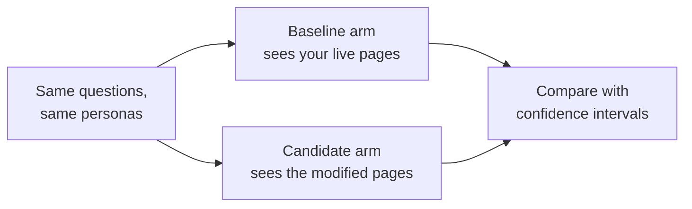

**Native mode** calls a provider's own hosted search (real OpenAI among the compatible providers). It cannot be
intercepted, so it is used for what the **real world** sees (baseline, post-deployment and drift). Providers without
built-in search (Ollama etc.) get the same real-world measurement by running the tool loop against the live web.

Human gates sit at **approval** and **confirm-live**. A crash or restart resumes at the failed stage, never
repeating finished, paid stages. Deploys are snapshotted first and refused if the live page changed since the proposal;
rollback re-deploys the previous content as a new version.

### Token-cost controls
- One-time KB build, skipped when page content hash is unchanged; agents get a compact card, not the site.
- The card, brief and tool list form a prompt-cache prefix for optimizer, persona and judge calls.
- A cheaper "fast" model handles the many small jobs; the main model is used only for the hard work.
- Stages persist output, so a resumed run never repeats finished stages.
- Every call lands in a usage ledger (per component, run and model), shown in the app's spend view.
- Pacing adapts to rate limits and falls back to the fast model when a daily quota is exhausted.

---

## 🧰 Tech stack

<p>


</p>

| Layer | Technology |
|---|---|
| **Web app** | React 19, TypeScript 5, Vite 7, Tailwind CSS 4, Radix UI / shadcn components, React Router 7, Motion, Sonner |
| **API** | Python 3.13, FastAPI, Pydantic (+ pydantic-settings), Uvicorn |
| **Persistence** | SQLAlchemy 2 on SQLite (Postgres-ready), content-addressed blob store for page snapshots |
| **AI models** | OpenAI-compatible SDK: OpenAI, Google Gemini, Ollama, OpenRouter, Groq, LM Studio, vLLM. Optional Anthropic and Google GenAI adapters |
| **Search** | DuckDuckGo (`ddgs`, no key), Tavily, Brave, SearXNG |
| **Crawling and analysis** | httpx, BeautifulSoup, JSON Schema validation, BM25 retrieval, Lighthouse |
| **Statistics** | Wilson intervals, bootstrap confidence intervals, paired comparisons |
| **Jobs** | APScheduler (drift checks, post-deploy wake-ups) |
| **Tooling** | uv (Python), npm, pytest (154 tests) |
| **Packaging** | Multi-stage Docker image, Docker Compose, `run.sh` |

---

## 🔒 Security and safety model

Confiance is built so that an AI agent can *propose* but never *decide*, and so that any mistake is recoverable.

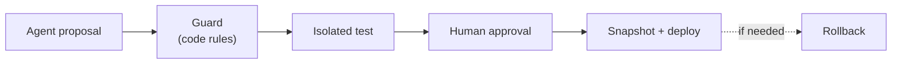

Every step is recorded in the hash-chained audit log.

| Control | How it works |
|---|---|
| **Strict guardrails** | Deterministic code, not a prompt (`optimizer/guard.py`). Client rules: editable URL globs, locked CSS selectors (must stay byte-identical), locked phrases, allowed operations, forbidden claims, and a maximum change ratio per page. Platform rules: no invented numbers, no hidden text, no instructions aimed at AI models, valid JSON-LD. A blocked proposal goes back to the agent; it cannot override the guard. The brief is versioned and immutable. |
| **Containerized, isolated testing** | Simulations never touch the client site. They run against snapshots, never the live site, inside the service's container, which runs as a non-root user and keeps all state in a single volume. Deployers are only invoked after human approval. |
| **Snapshots and rollback** | Page content is stored content-addressed and never overwritten; versions form a parent chain. Deploy refuses if the live page changed since the proposal. Rollback re-deploys the previous content as a **new** version, so history is only ever appended. |
| **Mandatory approval** | Nothing deploys unapproved. PR and CMS-draft deploys stay `draft_open` until a human confirms they are live, and only then does the live pointer move and measurement start. |
| **Tamper-evident audit** | Append-only and hash-chained (`audit.py`); `GET /api/audit/verify` detects any edit or deletion. Every tool call, guard verdict, approval, deploy and alert is logged. |
| **Secrets** | Stored owner-only on the data volume; never returned to the browser. |
| **Bounded spend** | Hard loop limits, run-size presets with request estimates, rate-limit pacing, a per-call cost ledger. |

---

## ⚙️ Running and operating it

### Docker

```bash
./run.sh --docker          # build + start; data lives in the `confiance-data` volume
./run.sh logs              # follow logs
./run.sh stop              # stop (data is kept)
docker compose down -v     # stop AND delete all data
```

- **Port:** `PORT=9000 ./run.sh --docker`.
- **Local models from the container:** use `http://host.docker.internal:11434/v1` as the Ollama address (the compose
  file maps it on Linux too).
- **Back up / move your data:** the volume holds `confiance.db`, `blobs/` and `secrets.json`.
  ```bash
  docker run --rm -v botb_confiance-data:/data -v "$PWD":/backup alpine tar czf /backup/confiance-data.tgz -C /data .
  ```
  (the volume name is `<folder>_confiance-data`; see `docker volume ls`).
- **Health:** `GET /api/health` (used by the container health check).
- **Lighthouse:** the image does not bundle Chrome; it falls back to Google's PageSpeed Insights API (set
  `CONFIANCE_PAGESPEED_API_KEY` for reliable use) or skips it. Local installs with Chrome run Lighthouse directly.

### Local install

`./run.sh --native` serves the built web app and API from one port (default 8000). Data lives in `backend/`
(`confiance.db`, `data/`). `./run.sh --dev` runs Vite with hot reload on `:5173` and the API with `--reload`.

### Practice with fake data (no AI, no keys)

```bash
cd backend
CONFIANCE_DATABASE_URL=sqlite:///./demo.db CONFIANCE_BLOB_DIR=./data/demo-blobs CONFIANCE_ALLOW_OFFLINE=true \
  uv run python scripts/seed_demo.py
CONFIANCE_DATABASE_URL=sqlite:///./demo.db CONFIANCE_BLOB_DIR=./data/demo-blobs CONFIANCE_ALLOW_OFFLINE=true \
  uv run uvicorn confiance.api.app:app --port 8000
```

### API

The web app talks to a plain REST API under `/api` (interactive docs at `/docs` when running). The main resources:

| Area | Examples |
|---|---|
| Setup | `GET /api/setup/status`, `PUT /api/setup/config`, `POST /api/setup/test-llm`, `POST /api/setup/test-search` |
| Projects | `POST /api/simple/projects`, `GET /api/projects/{id}/overview`, `.../pages`, `.../kb`, `.../products` |
| Rounds | `POST /api/projects/{id}/runs`, `GET /api/runs/{id}/live`, `.../loops`, `.../proposals`, `.../report` |
| Decisions | `POST /api/runs/{id}/decide`, `POST /api/deployments/{id}/confirm-live`, `POST /api/deployments/{id}/rollback` |
| Trust | `GET /api/audit`, `GET /api/audit/verify`, `GET /api/drift`, `GET /api/alerts`, `GET /api/usage` |

---

## 🔧 Configuration

The app needs **no configuration files**: model, key and search are entered in the UI. Advanced tuning uses
`CONFIANCE_*` environment variables (or a `.env` next to the backend); all are defined in
[`backend/src/confiance/config.py`](backend/src/confiance/config.py)..

| Variable | Default | Purpose |
|---|---|---|
| `CONFIANCE_LLM_BASE_URL` / `_API_KEY` / `_MODEL` | OpenAI / none / none | Model connection (normally set in the UI). |
| `CONFIANCE_LLM_WORKER_MODEL` | main model | Cheaper model for the many small jobs. |
| `CONFIANCE_LLM_MAX_CONCURRENCY` / `_RPM` | 4 / unlimited | Parallel calls and per-minute cap (lower for free tiers or small GPUs). |
| `CONFIANCE_SEARCH_PROVIDER` | `duckduckgo` | `duckduckgo`, `searxng`, `tavily`, `brave`. |
| `CONFIANCE_SAMPLES_PER_QUESTION` | 3 | More samples = tighter confidence intervals, more AI requests. |
| `CONFIANCE_DRIFT_INTERVAL_MINUTES` | 1440 | How often the canary panel runs. |
| `CONFIANCE_POST_DEPLOY_MEASURE_AFTER_HOURS` | 72 | Delay before the real-world check. |
| `CONFIANCE_DATABASE_URL` | `sqlite:///./confiance.db` | Use Postgres for multi-user installs. |
| `CONFIANCE_SLACK_WEBHOOK_URL`, `CONFIANCE_SMTP_*` | none | Alert delivery. |

---

## 🗂️ Repository layout

```
.
├── run.sh                    one-command setup and launcher
├── Dockerfile                multi-stage image (web build → Python runtime)
├── docker-compose.yml        service + persistent volume
├── assets/                   README screenshots and diagrams
├── backend/                  FastAPI service (Python 3.13, managed by uv)
│   ├── src/confiance/
│   │   ├── api/              REST endpoints (app.py, simple.py, v2.py)
│   │   ├── pipeline/         orchestrator state machine, run plans
│   │   ├── discovery/        crawl, site audit, Lighthouse, products
│   │   ├── research/         real-search research stage
│   │   ├── optimizer/        ReAct agent, guard, edit ops, new pages
│   │   ├── sim/              personas, runner, metrics, stats, verdicts, findability
│   │   ├── search/           search providers + counterfactual sandbox
│   │   ├── engines/          assistant adapters (OpenAI-compatible; Claude/Gemini/offline)
│   │   ├── kb/               knowledge base (BM25 retrieval, content-hash cache)
│   │   ├── plan/             tailored improvement plan and ready-to-use drafts
│   │   ├── deploy/           git draft PR, CMS (WordPress), export package, service
│   │   ├── drift/            canary-based engine drift monitor
│   │   └── snapshots.py, audit.py, scheduler.py, notify.py, usage.py, ...
│   ├── tests/                154 tests (no network or keys needed)
│   └── scripts/seed_demo.py  practice data
└── frontend/                 React app
    └── src/
        ├── landing/          marketing site (/, /product, /pricing)
        └── pages/            dashboard screens (Overview, Visibility, Optimize, Plan, ...)
```

---

## 🛠️ Development

```bash
./run.sh --dev             # API with reload on :8000, web app with HMR on :5173
./run.sh test              # or: cd backend && uv run pytest
cd frontend && npm run build   # type-check and production build
```

- Tests use scripted fakes; nothing calls a real model or the network.
- Adding an assistant adapter: implement the engine contract in `backend/src/confiance/engines/` and register it.
- Adding a deploy target: implement `Deployer` in `backend/src/confiance/deploy/` (deployers never decide *what* ships).
- When testing manually, prefer a local model (Ollama) and free DuckDuckGo search so it costs nothing.

---

## 🧱 Project status (MVP)

> **Confiance is at MVP / prototype stage.** The product described above is the complete vision and the design the
> code is built around. The code in this repository implements its core and is best treated as a working prototype,
> not yet a hardened, multi-tenant service. This table says plainly where each capability stands today.

| Capability | State in this repository |
|---|---|
| Agentic loop (ReAct optimizer, guard feedback, loop limits, plateau stop) | ✅ Implemented and tested |
| Digital twins: personas, sandboxed search, paired baseline/candidate simulation | ✅ Implemented and tested |
| Automated testing with confidence intervals and verdicts | ✅ Implemented and tested |
| Knowledge base (BM25, content-hash cache) | ✅ Implemented and tested |
| Constraint guard, mandatory approval, snapshots, rollback, hash-chained audit | ✅ Implemented and tested |
| Post-deployment measurement (scheduled wake-up, same questions vs baseline) | ✅ Implemented; needs real-world time to show results |
| Engine drift detection (canary panel, baselines, alerts) | ✅ Implemented and tested; run against real engines on a schedule |
| Anti-Goodhart protection | 🟡 Core defences in place (guard, paired design, separate metrics, conservative verdicts, human gate, live check); held-out question sets and automatic cross-checks are planned |
| Containerized isolated testing environment | 🟡 The service ships as a hardened container and never touches client sites during tests; per-round disposable containers for the assistant tool loop are planned |
| Deployers | 🟡 Export package and Git draft PR are usable (static-HTML sites); the CMS/WordPress connector is written but not exposed in the app |
| Engines | 🟡 Any OpenAI-compatible model is exposed; Claude and Gemini adapters exist but are switched off in the app |
| Multi-user accounts, SSO, hosted multi-tenant deployment | ⬜ Not yet |

<div align="center"><sub>Confiance · MVP · Built to make brands findable, citable and correctly described by AI.</sub></div>
