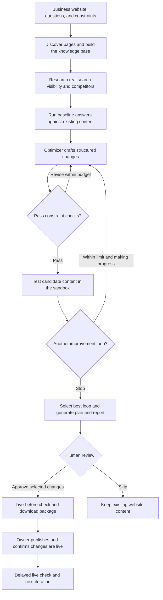
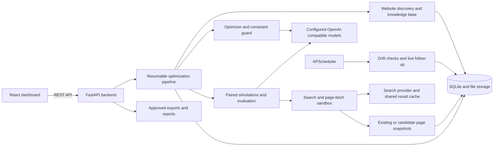

# CONFIANCE

**Help AI assistants find your business, cite your website, and describe what you offer accurately.**

Confiance is an agentic **Generative Engine Optimization (GEO)** application. It reads a business's website, tests how an AI assistant answers customer questions, proposes content improvements, and compares those changes in a sandbox before a person approves them.

For example, a plumbing business can test whether an assistant mentions it for “Who can fix a leaking pipe in Austin?”, inspect the answers before and after a proposed FAQ, and download the approved changes for its website.

**Start here:** [Judge walkthrough](#judge-walkthrough) · [How it works](#how-it-works) · [Tech stack](#tech-stack) · [Run locally](#run-locally) · [Limitations](#limitations)

## What the application does

- **Understands the website:** discovers pages through robots.txt, sitemaps, and llms.txt; builds a knowledge base; identifies products; and audits site health.
- **Measures visibility:** checks real search results and tests brand and product questions against the configured AI model.
- **Drafts and tests improvements:** proposes page edits, FAQs, metadata, structured data, and new pages, then compares their effect across bounded improvement loops.
- **Keeps the owner in control:** checks proposals against protected wording and forbidden claims, shows exact changes, and requires approval before preparing delivery.
- **Produces usable deliverables:** a prioritized improvement plan, HTML/Markdown reports, and a download package containing approved changes and supporting site files.
- **Tracks what happens next:** schedules a live check after publication is confirmed and monitors changes in model behavior.

## Judge walkthrough

### Review without installing

This repository documents a local setup; a hosted demo or recorded walkthrough is not linked here yet. For a quick repository review, start with the [workflow diagrams](#how-it-works), read [how to interpret results](#how-to-interpret-results), and use the [repository guide](#repository-guide) to inspect the implementation.

### Walk through the application

Once the app is running, open the [dashboard](http://localhost:5173/dashboard). The marketing pages at `/`, `/product`, and `/pricing` explain the product; **Open dashboard** enters the working application.

1. **Connect a model.** Choose an OpenAI-compatible provider, select a model that supports tool calling, and use the connection test. Keep DuckDuckGo for search without a search API key.
2. **Add a business.** Enter its name and public website URL. Let Confiance read the site, then review the suggested customer questions and detected products.
3. **Set the boundaries.** Specify sentences to preserve, claims to avoid, and pages that may be edited. The current dashboard delivers improvements as downloadable files.
4. **Start a round.** Open **Optimize**, choose brand and/or product questions, select **Quick check**, and click **Start the round**. The page shows progress and an activity feed; duration depends on the model, site, and provider limits.
5. **Inspect the evidence.** In the completed round, compare **Summary**, **Loops**, and **Answers**. Open **Changes** to see the exact wording and any proposals blocked by the guard.
6. **Review the deliverables.** Open **Plan** for prioritized actions and **Reports** for HTML/Markdown exports. Approving selected changes runs the pre-publication live check and prepares a downloadable package; it does not publish files to your website.

For judging, the review and download steps demonstrate the core workflow. The later **The changes are now on my website** action is for confirming an actual publication and scheduling the live follow-up.

| Dashboard area | What to look for |
| --- | --- |
| **Overview** | Business status, recent results, and recommended next steps. |
| **Visibility** | Brand/product results and the **Discoverability** tab for real search findings. |
| **Products** | Detected or manually added products and their shopper questions. |
| **Site health** | Crawl findings, technical issues, and page-level checks. |
| **Optimize** | Run setup, live progress, improvement loops, answer comparisons, and approval. |
| **Plan** | Prioritized actions and ready-to-use drafts. |
| **Reports** | A readable report for each round, with HTML and Markdown downloads. |
| **Activity** | Recorded events for tracing what the system did. |
| **Settings** | Business details, protected wording, AI connections, model health, and usage estimates. |

### How to interpret results

Confiance separates two questions that are easy to confuse:

| Measurement | What it tells you | How to read it |
| --- | --- | --- |
| **Findability** | Does the site appear in real search results for the target questions? | Observed search visibility at the time of the check. |
| **Usefulness when found** | Does the assistant use, mention, or cite the page when it is shown? | A controlled sandbox comparison of existing and proposed content. |
| **Live follow-up** | How do answers change after the approved content is published? | A later live-web check, subject to recrawling delays and changes outside the application. |

The sandbox inserts a matching business page when it is absent from search results, using the same configured insertion rank in both arms; naturally returned pages retain their positions. Existing pages use baseline or proposed snapshots, while new pages appear only in the candidate arm. Tests pair customer personas, questions, and samples and share cached search results to reduce variation from retrieval. Model responses and the matching page can still vary: inspect the paired comparisons, confidence intervals, and actual answers alongside the verdict.

**A better sandbox score does not prove better search rankings.** The “uses your page” signal is based on phrase overlap, and the visibility score combines several signals; neither is a market-wide ranking or a guarantee of factual accuracy. Brand and product results are tracked separately. See [the measurement guide](docs/measuring-improvement.md).

## How it works

### From website to reviewed improvements



Rounds default to a maximum of **3 improvement loops**, configurable from **1 to 10**, and can stop early when progress plateaus. The best loop is selected for review. Completed stages are persisted so an interrupted run can resume without restarting the entire pipeline.

### System architecture



In controlled tests, Confiance executes the assistant's `web_search` and `fetch_page` tools. Third-party results come from the search provider; content for the business's own site comes from the stored baseline or candidate snapshots. Live measurements use the web without candidate content substitution.

## Tech stack

| Layer | Technologies | Purpose |
| --- | --- | --- |
| Frontend | React 19, TypeScript, Vite 7 | Dashboard, onboarding, and marketing pages. |
| UI | Tailwind CSS 4, Radix UI, Lucide, Motion | Styling, accessible UI primitives, icons, and animation. |
| Backend | Python 3.13+, FastAPI, Uvicorn, Pydantic | API, validation, configuration, and background work. |
| Data | SQLAlchemy, SQLite, content-addressed files | Projects, runs, metrics, page versions, and audit events. |
| AI | OpenAI-compatible client; optional Anthropic and Google SDK adapters | Tool-using agents and answer simulations. The dashboard uses the configured OpenAI-compatible endpoint. |
| Discovery and search | HTTPX, Beautiful Soup, DuckDuckGo; optional Tavily, Brave, SearXNG | Page fetching, parsing, and search. |
| Retrieval and scheduling | BM25, APScheduler | Knowledge-base retrieval, drift checks, and delayed measurements. |
| Development | uv, npm, pytest, TypeScript compiler | Dependency management, backend tests, and frontend build checks. |

Dependencies are declared in [frontend/package.json](frontend/package.json) and [backend/pyproject.toml](backend/pyproject.toml), with lockfiles in both directories.

## Run locally

### Prerequisites

- **Node.js 22.12+ and npm**. The locked Vite version also supports Node.js 20.19+ within the 20.x release line.
- **uv** and **Python 3.13+** for the backend. uv can provision a compatible Python interpreter if one is unavailable.
- **Bash**, available on macOS/Linux or through WSL on Windows.
- Internet access for the initial dependency installation and for real website/search requests. Real optimization also needs a reachable model with tool-calling support.

### Start both services

Clone or extract the repository, open a terminal in its root folder, and run:

```bash
./run.sh
```

If an extracted ZIP does not preserve executable permissions, use `bash run.sh`.

The root [run.sh](run.sh) delegates to [start.sh](start.sh), which checks for uv/npm, synchronizes backend dependencies, installs frontend dependencies if `node_modules` is absent, starts both development servers, and opens the browser. Stop the services with **Ctrl+C** in that terminal.

| Service | Local address |
| --- | --- |
| Marketing site | [http://localhost:5173](http://localhost:5173) |
| Application | [http://localhost:5173/dashboard](http://localhost:5173/dashboard) |

Keep ports **5173** and **8000** available. The frontend proxies `/api` requests to the backend on port 8000. This launcher runs the development environment; the repository does not currently include a container configuration.

### Connect AI and search

Configure connections in the welcome screen or **Settings → AI & delivery**. No `.env` file is needed for the guided setup.

| Connection option | Configuration in the app |
| --- | --- |
| **Ollama** | Run a local model that supports tool calling; use `http://localhost:11434/v1`. No provider API key is required for this local connection. |
| **Google Gemini** | Select the preset, enter your provider key, and choose a model returned by **Find my models**. |
| **OpenAI** | Select the preset, enter your provider key, and choose a tool-capable model. |
| **Other compatible services** | Enter the service's OpenAI-compatible base URL, credentials if required, and model name. |

The **main model** handles optimization; an optional **fast model** handles smaller jobs and the controlled assistant simulations. If no fast model is configured, the main model handles both roles. Hosted model access, quotas, and charges depend on the provider and account.

DuckDuckGo is the default search option and requires no search API key. Other search backends are implemented for Tavily, Brave, and SearXNG. Local models still use network access for website discovery and real search.

### Data and configuration

With the default launcher, local data is stored in:

- `backend/confiance.db` — SQLite application data.
- `backend/data/blobs/` — versioned page content.
- `backend/data/secrets.json` — connection settings, saved with owner-only file permissions. Secret values are omitted from configuration API responses.

These runtime files are ignored by Git. Advanced settings use the `CONFIANCE_` prefix; see [config.py](backend/src/confiance/config.py) for database, storage, pacing, scheduling, and notification options.

### Development commands

Run backend tests from the repository root:

```bash
cd backend
uv run pytest
```

Type-check and build the frontend from the repository root:

```bash
cd frontend
npm ci
npm run build
```

The frontend build writes to `frontend/dist/`; it does not package or start the backend. If frontend dependencies change after the first launch, run `npm ci` inside `frontend/` before restarting.

The [demo seed script](backend/scripts/seed_demo.py) is a developer fixture with scripted data and an offline engine. Its results are synthetic, not evidence of real visibility gains; use a separate database and storage paths when experimenting with it.

## Review controls and observability

- **Constraint checks:** structured edits pass through a code-level guard for editable URLs, locked phrases/selectors, forbidden claims, change limits, unsupported numbers, hidden text, model-directed instructions, and JSON-LD parsing. These checks do not establish factual truth.
- **Explicit approval:** only approved proposals enter delivery. Downloading an export or opening a draft does not mark content as live; publication must be confirmed separately.
- **Version history:** content-addressed snapshots and versioned briefs preserve inputs. Delivery checks proposals against the stored live version, and rollback creates a new history entry.
- **Traceability:** activity feeds, token usage records, and a hash-chained audit log expose the work behind a result. `GET /api/audit/verify` checks the stored chain's integrity.
- **Bounded work:** run-size choices, loop limits, request pacing, cached knowledge-base content, and persisted stages help control model usage. Drift monitoring runs daily by default.

## Limitations

1. **Sandbox results measure content effects under controlled exposure.** They do not establish ranking gains or guarantee the same answer on another run.
2. **Provider APIs differ from consumer products.** A configured API model does not reproduce every behavior of ChatGPT, Gemini's consumer app, or Google AI Overviews. AI Overviews is not covered.
3. **Integration coverage varies.** The project's documented live validation covers the local-model path. Native OpenAI search and delivery connectors need live integration validation; separate Claude/Gemini adapters are not selectable through the guided dashboard.
4. **The dashboard currently offers export delivery.** Git draft-PR and WordPress connectors exist in the backend but are not exposed in the UI. Git delivery writes HTML to a page's `source_path`, which suits static HTML; framework sites need integration work.
5. **Storage and cost reporting are prototype-oriented.** SQLite is the default and retrieval uses BM25. Concurrent audit writes need serialization if adapting the app to PostgreSQL. Models missing from the pricing table record tokens with a zero dollar estimate, so the UI is not an authoritative bill.
6. **Live evidence takes time.** Follow-up measurement defaults to 72 hours after publication is confirmed; search engines may take longer to recrawl the site.

## Repository guide

| Path | What it contains |
| --- | --- |
| [frontend/src/pages/](frontend/src/pages/) | Dashboard screens and the guided workflow. |
| [frontend/src/landing/](frontend/src/landing/) | Home, product, and pricing pages. |
| [backend/src/confiance/api/](backend/src/confiance/api/) | FastAPI endpoints backing the application. |
| [backend/src/confiance/pipeline/](backend/src/confiance/pipeline/) | Resumable rounds and bounded improvement loops. |
| [backend/src/confiance/optimizer/](backend/src/confiance/optimizer/) | Agent, structured operations, and constraint guard. |
| [backend/src/confiance/search/](backend/src/confiance/search/) and [sim/](backend/src/confiance/sim/) | Search providers, sandbox substitution, scoring, and paired evaluation. |
| [backend/src/confiance/deploy/](backend/src/confiance/deploy/) | Approval-gated delivery, export packages, and rollback. |
| [backend/tests/](backend/tests/) | Tests for the pipeline, guard, APIs, measurement, reports, and audit behavior. |
| [docs/](docs/) | Measurement rationale and provider/search research. |

Further reading: [Measuring improvement](docs/measuring-improvement.md) · [Search integration](docs/search-integration-research.md) · [Model pacing and quota research](docs/free-tier-research.md).
